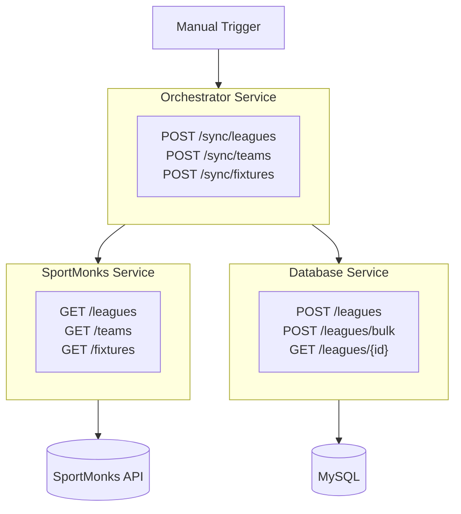

# InsightXI
### Overview
Application for collating sports data for visualisation. Data sourced from [SportMonks API](https://docs.sportmonks.com/football).

-----
### Tech Stack

- **Language:** Python
- **API Framework:** FastAPI
- **Database:** MySQL
- **Validation:** Pydantic
- **Linting:** Ruff
- **Project Manager:** uv
- **Containerisation:** Podman/Docker

-----
### Architecture


-----
### Services

**Orchestrator Service** - Coordinates data sync workflows between services
- Exposes sync endpoints for manual triggers
- Fetches data from SportMonks Service, stores via Database Service
- Handles errors and returns sync status

**SportMonks Service** - Handles all SportMonks API interactions
- Fetches and validates data from SportMonks
- Manages authentication, rate limiting, retries

**Database Service** - Handles all database operations
- CRUD endpoints per entity
- Bulk operations for data ingestion

-----
### Project Structure

```
services/
├── orchestrator-service/
│   ├── app/
│   │   ├── main.py
│   │   ├── controllers/
│   │   ├── services/
│   │   ├── clients/
│   │   └── models/
│   ├── tests/
│   ├── Dockerfile
│   └── pyproject.toml
│
├── sportmonks-service/
│   ├── app/
│   │   ├── main.py
│   │   ├── controllers/
│   │   ├── services/
│   │   ├── clients/
│   │   └── models/
│   ├── tests/
│   ├── Dockerfile
│   └── pyproject.toml
│
└── database-service/
    ├── app/
    │   ├── main.py
    │   ├── controllers/
    │   ├── services/
    │   ├── repositories/
    │   └── models/
    ├── tests/
    ├── Dockerfile
    └── pyproject.toml
```

-----
### Getting Started

**Run with Docker/Podman (recommended):**
```bash
make up           # Build and start all services + MySQL
make down         # Stop and remove all containers
make inspect-db   # Connect to MySQL CLI
```

**Local development:**
```bash
make install      # Install dependencies for all services
```

**Trigger a sync:**
```bash
curl -X POST http://localhost:8002/sync/leagues
```
