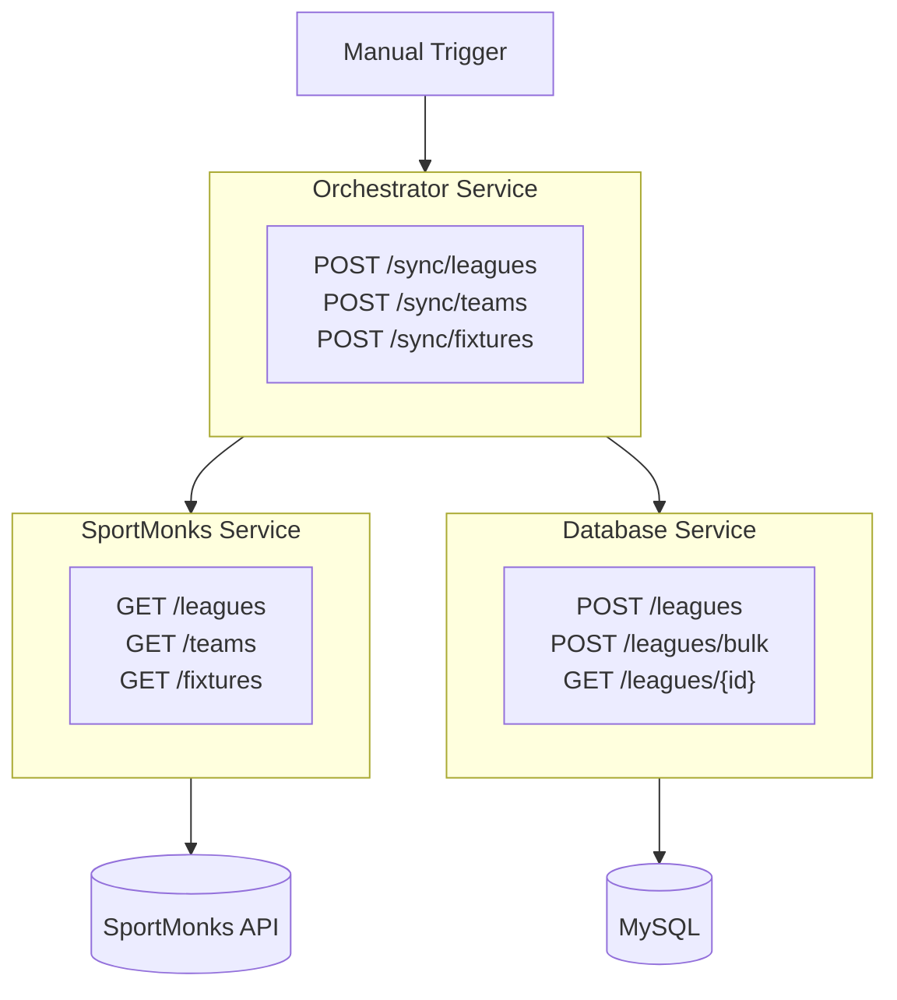
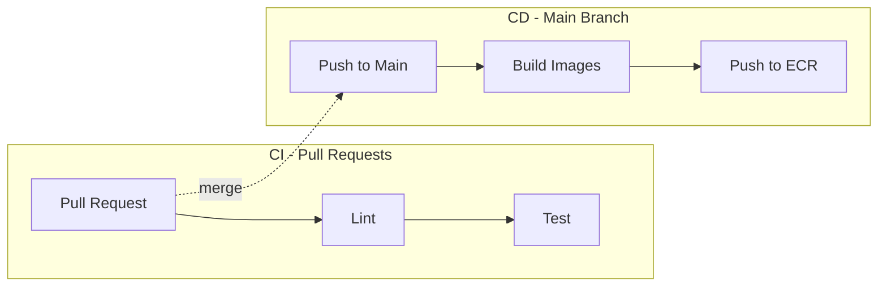
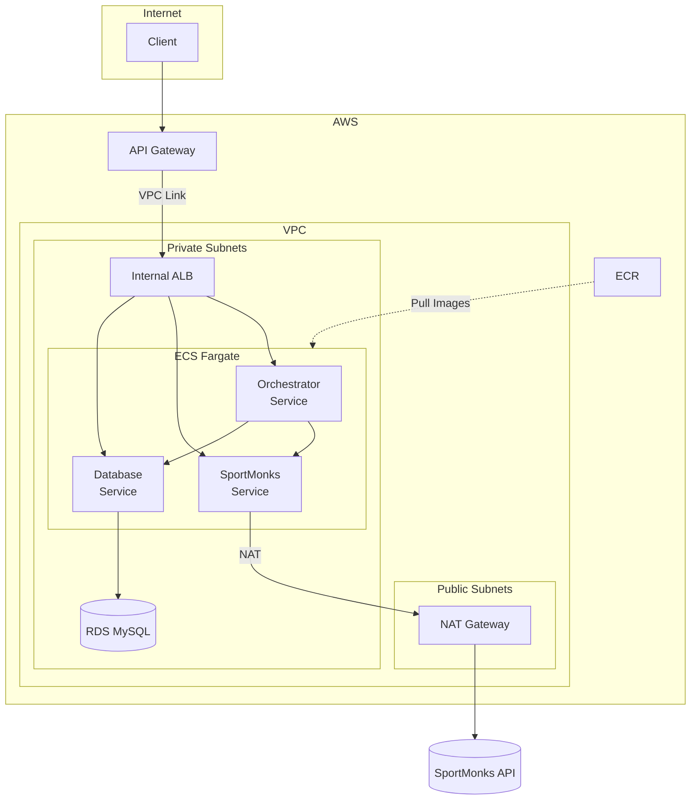

# InsightXI
### Overview
Application for collating sports data for visualisation. Data sourced from [SportMonks API](https://docs.sportmonks.com/football).

-----
### Tech Stack

| Category | Technology |
|----------|------------|
| **Backend** | Python, FastAPI, Pydantic |
| **Database** | MySQL, SQLAlchemy |
| **Infrastructure** | Docker, Terraform, GitHub Actions |
| **AWS** | ECS Fargate, RDS, API Gateway, ALB, ECR |
| **Development** | uv, Ruff, pytest |

-----
### Architecture


-----
### Services

**Orchestrator Service** - Coordinates data sync workflows between services
- Exposes sync endpoints for manual triggers
- Fetches data from SportMonks Service, stores via Database Service
- Handles errors and returns sync status

**SportMonks Service** - Handles all SportMonks API interactions
- Fetches and validates data from SportMonks
- Manages authentication, rate limiting, retries

**Database Service** - Handles all database operations
- CRUD endpoints per entity
- Bulk operations for data ingestion

-----
### Project Structure

```
services/
├── orchestrator-service/
│   ├── app/
│   │   ├── main.py
│   │   ├── controllers/
│   │   ├── services/
│   │   ├── clients/
│   │   └── models/
│   ├── tests/
│   ├── Dockerfile
│   └── pyproject.toml
│
├── sportmonks-service/
│   ├── app/
│   │   ├── main.py
│   │   ├── controllers/
│   │   ├── services/
│   │   ├── clients/
│   │   └── models/
│   ├── tests/
│   ├── Dockerfile
│   └── pyproject.toml
│
└── database-service/
    ├── app/
    │   ├── main.py
    │   ├── controllers/
    │   ├── services/
    │   ├── repositories/
    │   └── models/
    ├── tests/
    ├── Dockerfile
    └── pyproject.toml
```

-----
### Getting Started

**Run with Docker/Podman (recommended):**
```bash
make up           # Build and start all services + MySQL
make down         # Stop and remove all containers
make inspect-db   # Connect to MySQL CLI
```

**Local development:**
```bash
make install      # Install dependencies for all services
```

**Trigger a sync:**
```bash
curl -X POST http://localhost:8002/sync/leagues
```

-----
### CI/CD Pipeline



**CI (on every PR):**
- Runs Ruff linter on all services
- Runs pytest for all services

**CD (on merge to main):**
- Builds Docker images for all services
- Pushes to Amazon ECR with commit SHA and `latest` tags

-----
### AWS Architecture



**Traffic Flow:**
1. Client requests hit API Gateway (public endpoint)
2. API Gateway routes through VPC Link to internal ALB
3. ALB routes to ECS services based on path
4. Services communicate internally via ALB
5. Outbound API calls go through NAT Gateway
